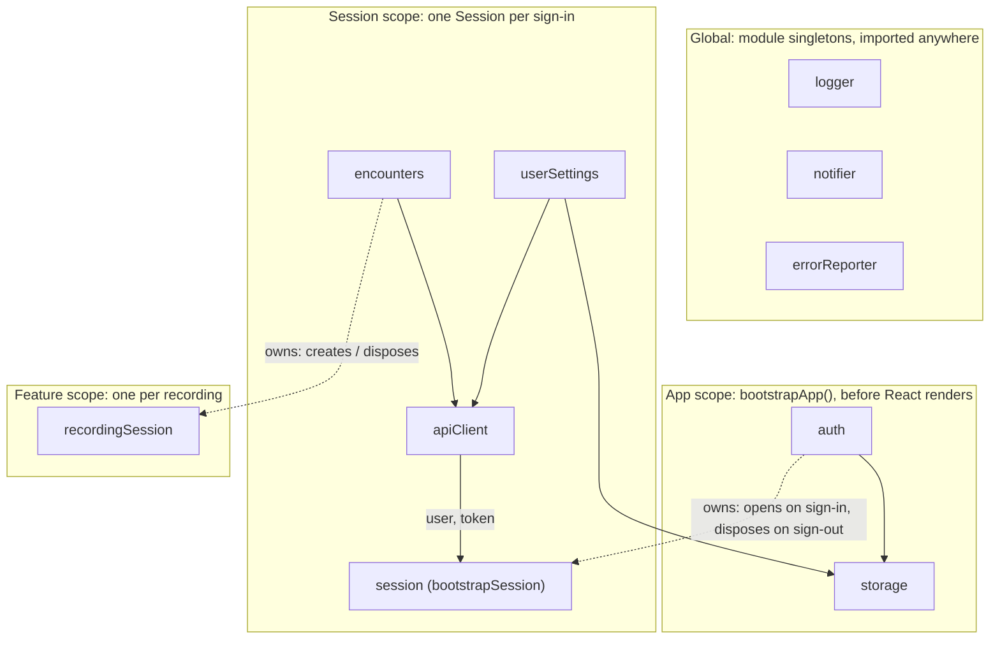

# React app with services outside the React tree

A small Nabla-style medical scribe (encounters list, note, fake recording, settings), built to show one idea: **business logic lives in plain TypeScript services, and React only displays it.**

1. **Framework-agnostic core services.** Each service is a class behind an interface. Its public API is state + commands + lifecycle (`init` / `dispose`). Nothing under `src/services/` imports React, and `npm run build` checks that (`npm run check:layers`).
2. **Explicit bootstrapping.** Scoped services are created, initialized and torn down by plain functions (`bootstrapApp`, `bootstrapSession`), written top to bottom. Provider nesting plays no part in it.
3. **Hooks as thin adapters.** React gets a handle to a service through Context (or a plain import, for globals), subscribes with `useSyncExternalStore`, and passes the commands through. Hooks hold no logic.

## Where things live

The folder says which scope a service belongs to, so it also says how long the service lives:

```
src/services/
  global/    logger, notifier, errorReporter   module singletons: import them directly
  app/       storage, auth, bootstrapApp       created once, before React renders, then injected
  session/   session, apiClient, userSettings, encounters, bootstrapSession
                                               from sign-in to sign-out
  feature/   recordingSession                  one per recording
  shared/    Store, Disposable, delay, demoFlags (helpers, not services)
src/context/  AppServicesContext, SessionServicesContext   hand services to React
src/hooks/    useAuth, useSession, useEncounters, …        subscribe to them
```

**The dependency rule:** using a service points outward, and owning a child scope points one step inward.

- A file uses its own scope and outer ones: `feature` → `session` → `app` → `global` → `shared`.
- Only an **owner** reaches one scope inward, to create the child it owns: `app/auth.ts` creates the `Session`, and `session/encounters.ts` creates the `RecordingSession`. Nothing else does.

`npm run check:layers` ([`scripts/check-layers.mjs`](scripts/check-layers.mjs)) enforces both rules, and also that nothing under `src/services/` imports React. The owners are listed in that file. Helpers that exist only for the UI live next to the UI: `getSessionServices`, used by router hooks, is in [`routes/-lib/`](src/routes/-lib/getSessionServices.ts).

### Global or injected?

Not everything needs dependency injection. `logger`, `notifier` and `reportError` are **module singletons**: services, routes and components import them directly. That fits a service that:

- has no dependencies on scoped services and no async setup,
- lives as long as the page, so it never needs disposing,
- is ambient: almost everything uses it, and passing it through every constructor only adds noise.

Everything else is injected: services that need `init()` (`storage`), or hold per-user data (anything under `session/`).

The trade-offs, which a real app should weigh:

- **Tests.** A global can't be replaced per instance, so a test has to mock the module instead of passing a fake.
- **Configuration.** A real error reporter (Sentry in prod, the console in dev) needs a DSN, a release and the current user. You'd keep it global but configure it from `bootstrapApp` (e.g. `configureErrorReporter(…)`), and set its user from the session. Here `session.ts` passes the user by hand.
- **UI copy in services.** Services call `notifier.notify({ message: 'Preferences saved' })` themselves. That's a deliberate shortcut: it shows that non-React code can reach the UI. In a larger app, services would return or throw, and callers would pick the wording (and the language).

## Running it

```sh
npm install
npm run dev      # http://localhost:3000
```

Other scripts:

| Script | What it does |
|---|---|
| `npm run typecheck` | `tsc -b`: type-checks the app (`tsconfig.app.json`, browser) and the Vite config (`tsconfig.node.json`, Node), incrementally |
| `npm run check:layers` | enforces the dependency rule between scopes, and that nothing under `src/services/` imports React or TanStack |
| `npm run build` | `check:layers` → `tsc -b` → `vite build` into `dist/` |
| `npm run preview` | serves the production build |

Open the browser DevTools **console**. Every service logs its lifecycle with a colored scope prefix:

```
[global] notifier + created
[app] storage + created
[app] storage … init
[app] storage ✓ init (633ms)
[session] apiClient → GET /encounters
[feature] recordingSession ✗ disposed
```

## Scopes



| Scope | Created | Disposed |
|---|---|---|
| Global | when the module is first imported | never |
| App | once, by `bootstrapApp()` in `main.tsx` | never during normal use (`app.dispose()` exists) |
| Session | by `auth` on sign-in (or on startup if the user was restored) | by `auth` on sign-out, services in reverse creation order |
| Feature | by `encounters.startRecording(id)` | on opening another encounter, going back to the list, or signing out |

The session and the recording follow the same pattern: **the parent service holds the child in its state**. `auth.getState()` is `{ status: 'signedIn', user, session }`, just like `encounters.getState().recording`. Signing out disposes the session the same way opening another encounter disposes the recording. There's no separate manager listening to `auth`.

## Code tour: suggested reading order

1. [`services/global/`](src/services/global/): the singletons. `export const logger = …`, `export const notifier = …`, `export function reportError(…)`. Nothing to wire.
2. [`services/app/auth.ts`](src/services/app/auth.ts): a typical injected service. Interface, `AuthDependencies`, class, `createAuthService` factory, `init` / `dispose`, reactive state through the [`Store`](src/services/shared/store.ts) helper. It also owns the session: `signIn()` creates one (closing any previous one), and `logout()` disposes it.
3. [`services/app/bootstrapApp.ts`](src/services/app/bootstrapApp.ts): the composition root, in two steps. First it **wires** every service by hand (constructors only store dependencies) and writes `dispose()` in reverse creation order. Then it **initializes** them in dependency order. If an `init()` fails, it disposes everything and rethrows.
4. [`main.tsx`](src/main.tsx): `bootstrapApp()` runs **before** React renders the app. React renders a spinner, an error screen, or the router. No `useEffect`.
5. [`services/session/session.ts`](src/services/session/session.ts) + [`bootstrapSession.ts`](src/services/session/bootstrapSession.ts): one `Session` per sign-in. It runs `bootstrapSession` and exposes `loading` / `ready` / `error` + `retry()`. A session is single-use, so one `disposed` flag is enough to discard a bootstrap that finishes after sign-out. (A real app would also pass an `AbortSignal` into `bootstrapSession`, to cancel in-flight requests instead of waiting for them.) `userSettings.init()` and `encounters.init()` run concurrently with `Promise.all`.
6. [`context/`](src/context/) + [`hooks/`](src/hooks/): the adapters. Contexts only carry services that already exist. Each hook is 3–10 lines: get the service, `useSyncExternalStore(service.subscribe, service.getState)`, return state + bound commands. `useNotifications` imports `notifier` instead of reading a context.
7. [`routes/_authenticated.tsx`](src/routes/_authenticated.tsx): the layout mirrors the session state (placeholder / error / `<Outlet/>`) and provides `SessionServicesContext`. It doesn't start or stop anything.
8. [`services/session/encounters.ts`](src/services/session/encounters.ts) + [`services/feature/recordingSession.ts`](src/services/feature/recordingSession.ts): a service that owns a nested scope, exactly like `auth` owns the session. `startRecording()` disposes the previous recording, creates the new one, then calls `start()`. `encounters.dispose()` disposes the active recording first, which is the cascading teardown.

## Placeholders

Screens that are about to load show grey placeholders shaped like the real screen ([`components/Placeholders.tsx`](src/components/Placeholders.tsx)). Two mechanisms are used, each where it fits:

- **The whole screen, while the session loads.** Each route declares its placeholder: `staticData: { placeholder: SettingsPlaceholder }`. While the session is `loading`, the authenticated layout renders the placeholder of the deepest matched route. This is plain state, not Suspense, because the session already exposes it.
- **Part of a screen, while its data loads: Suspense.** An encounter's note is fetched when you open it. The route's `onEnter` calls `encounters.openEncounter(id)`, which starts the fetch before the component renders (render-as-you-fetch). `encounters.getNote(id)` caches the promise for the rest of the session, so it returns the same one on every render. `useEncounterNote(id)` calls `use()` on it, and the detail page wraps it in `<Suspense fallback={<NotePlaceholder />}>` inside an `<ErrorBoundary>`. A failed fetch stays cached, because React re-renders once after a rejection and must get the same promise back. The boundary's Retry calls `encounters.invalidateNote(id)`, then re-renders, which fetches the note again. The service owns fetching and caching, and React only waits on the promise.

Trade-off: "the deepest match wins" means a screen's placeholder redraws its parent layouts (the encounters sidebar, the settings header and tabs). That's simple, but it drifts when a layout changes. The alternative is one placeholder per route level, nested like the layouts, or rendering layouts that don't need the session outside the session gate.

## Service conventions

- **Dependencies:** scoped services are passed in through `XxxDependencies`. Globals are imported.
- **Constructor:** stores dependencies and logs `created`. No timers, subscriptions or I/O. (`recordingSession` gets a `start()` for that, which its owner calls.)
- **`init()`** (optional, async): side effects and async setup.
- **`dispose()`:** undoes what `init()` did, and is safe to call even if `init()` never ran or failed.
- **Bootstrap functions are the async factories.** They wire everything, define `dispose()`, then initialize, and they resolve only when every service is ready. React and other services never see an uninitialized service. One deliberate exception: `auth.init()` *starts* the session without awaiting it, so app startup isn't blocked by session loading. The session has its own `loading` state for that.
- **No cycles between services.** Break them with a callback (`recordingSession`'s `onComplete`) or by extracting a third service. Owners and children may share *types* (`auth` holds a `Session`, `Session` takes a `User`), but only the owner calls into the child.

## Demo scenarios

Tip: run `localStorage.clear()` in the console to start from a signed-out state.

### 1. Cold start
Load `/`. The UI shows **"Starting app…"** while `storage` (~400–800 ms) and then `auth` initialize. In the console: `[app] … + created`, `… init`, `✓ init (Nms)`, all in creation order. Then you land on `/login`.

### 2. Login
Click **Sign in** (any email works). The UI shows a **placeholder of the encounters screen** while `bootstrapSession` runs. In the console: `[session] session + created`, `apiClient + created`, then `userSettings` and `encounters` initializing **in parallel**, with every API request logged (`→` / `←`).

### 3. Reload while signed in
Reload the page. You get the app spinner, then the placeholder of the current screen (try it on `/settings/profile` too), then the screen itself. In the console: `[app] auth restored … from storage`, and the session scope is bootstrapped without a login.

### 4. Open an encounter, record, then open another one
Open an encounter: the header shows right away and the note shows a placeholder while it's fetched (`GET /encounters/…/note`). Open it again later and it's instant, because the promise is cached. Click **Record**: a timer starts and a fake transcript line appears every ~2 s. A red pill in the top bar shows the recording. Open a different encounter: a **"Recording discarded"** toast appears and the console shows `[feature] recordingSession ✗ disposed`. The interval is cleared.

*(Optional: click **Stop** instead. You get a "Recording saved" toast, a `PATCH /encounters/…` request, and the encounter's badge turns **Completed**.)*

### 5. Record, then log out from settings
Start a recording, then go to **Settings**. The top-bar pill keeps counting: the recording is a service, so it outlives the encounter component. On **Profile**, click **Log out**:

```
[app] auth signed out
[feature] recordingSession ✗ disposed      ← feature scope first
[session] encounters ✗ disposed            ← then session services,
[session] userSettings ✗ disposed             in reverse creation order
[session] apiClient ✗ disposed
[session] session ✗ disposed
```

After this, any call to that `apiClient` throws `apiClient disposed`.

### 6. `?fail=storage` (app-level failure)
Open `/?fail=storage`. `storage.init()` throws after its normal delay. The console shows `✗ init failed`, every app service disposed in reverse creation order, and `[global] errorReporter ⚑ reported: …`. The UI shows the **error screen**. **Retry** runs `bootstrapApp()` again from scratch. `?fail=auth` works the same way.

### 7. `?fail=userSettings` (session-level failure)
Sign out, open `/login?fail=userSettings` and sign in. The session error screen appears **inside** the authenticated layout, and `errorReporter` logs the failure. The top bar still works, because app services are healthy: **Log out** works and toasts still show. **Retry** calls `session.retry()`, which bootstraps fresh session services.

### 8. `?fail=note` (a failure inside a screen)
Open `/encounters?fail=note` and open an encounter. The note's fetch fails: the rest of the screen stays usable, and the note area shows the error with a **Retry** link. Retry invalidates the cached failure and fetches again, and the note appears.

> **Failure flags only fail the first attempt** (per page load), so Retry succeeds. Reload the page with the param still in the URL to make it fail again.

### Bonus: logout while the workspace is loading
Sign in and click **Log out** while the placeholder is shown. The console shows `session signed out while loading, discarding its services`, and the half-built services are disposed instead of becoming `ready`.

## A note on recording disposal

A recording belongs to the **open encounter**. Opening another encounter or returning to the list disposes it (see `onEnter` / `onStay` in [`encounters/$encounterId.tsx`](src/routes/_authenticated/encounters/$encounterId.tsx) and `encounters.openEncounter()`). Visiting Settings doesn't dispose it. That keeps scenario 5 possible, and it shows the point of a service: its behavior can outlive the component that started it.

## Rule of thumb

Keep **visual, component-scoped** concerns in React: form drafts, hover/open state, a "Signing in…" button label. **Extract a service** when the behavior must outlive a component, be shared outside a UI subtree, be called from non-React code (another service, a router hook), or be tested without rendering anything.
