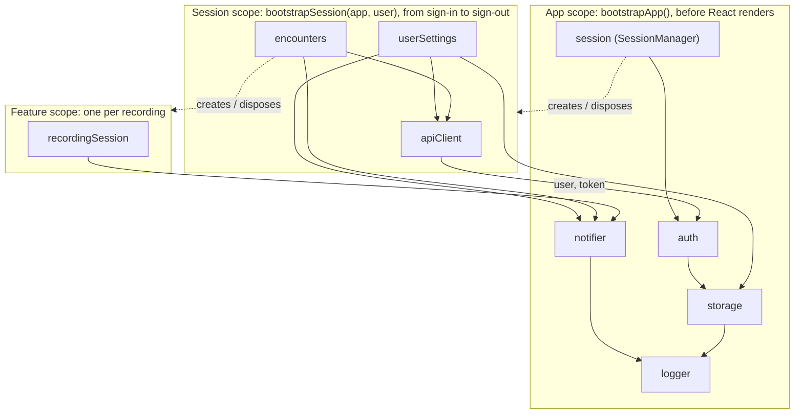

# React app with services outside the React tree

A small Nabla-style medical scribe (encounters list, note, fake recording, settings), built to show one idea: **business logic lives in plain TypeScript services, and React only displays it.**

1. **Framework-agnostic core services.** Each service is a class behind an interface, with its dependencies passed in explicitly. Its public API is state + commands + lifecycle (`init` / `dispose`). Nothing under `src/services/` or `src/bootstrap/` imports React, and `npm run build` checks that (`npm run check:layers`).
2. **Explicit bootstrapping.** Services are created, initialized and torn down by plain functions (`bootstrapApp`, `bootstrapSession`), written top to bottom. Provider nesting plays no part in it.
3. **Hooks as thin adapters.** React gets a handle to a service through Context, subscribes with `useSyncExternalStore`, and passes the commands through. Hooks hold no logic.

## Running it

```sh
npm install
npm run dev      # http://localhost:3000
```

Other scripts:

| Script | What it does |
|---|---|
| `npm run typecheck` | `tsc -b`: type-checks the app (`tsconfig.app.json`, browser) and the Vite config (`tsconfig.node.json`, Node), incrementally |
| `npm run check:layers` | fails if anything under `src/services/` or `src/bootstrap/` imports React or TanStack |
| `npm run build` | `check:layers` → `tsc -b` → `vite build` into `dist/` |
| `npm run preview` | serves the production build |

Open the browser DevTools **console**. Every service logs its lifecycle with a colored scope prefix:

```
[app] storage + created
[app] storage … init
[app] storage ✓ init (633ms)
[session] apiClient → GET /encounters
[feature] recordingSession ✗ disposed
```

## Scopes



| Scope | Created | Disposed |
|---|---|---|
| App | once, by `bootstrapApp()` in `main.tsx` | never during normal use (`app.dispose()` exists) |
| Session | by `SessionManager` on sign-in (or on startup if the user was restored) | on sign-out, in reverse creation order |
| Feature | by `encounters.startRecording(id)` | on opening another encounter, going back to the list, or signing out |

## Code tour: suggested reading order

1. [`src/services/auth.ts`](src/services/auth.ts): a typical service. Interface, `AuthDependencies`, class, `createAuthService` factory, `init` / `dispose`, reactive state through the [`Store`](src/services/shared/store.ts) helper. No React.
2. [`src/bootstrap/bootstrapApp.ts`](src/bootstrap/bootstrapApp.ts): the composition root, in two steps. First it **wires** every service by hand (constructors only store dependencies) and writes `dispose()` in reverse creation order. Then it **initializes** them in dependency order. If an `init()` fails, it disposes everything and rethrows.
3. [`src/main.tsx`](src/main.tsx): `bootstrapApp()` starts **outside** React. React only waits for that promise with `use()` + `<Suspense>` and shows a failure with an `<ErrorBoundary>` ([`react-error-boundary`](https://github.com/bvaughn/react-error-boundary)), whose reset starts a fresh bootstrap. No `useEffect`.
4. [`src/services/session.ts`](src/services/session.ts) + [`src/bootstrap/bootstrapSession.ts`](src/bootstrap/bootstrapSession.ts): the session lifecycle in plain TypeScript. It reacts to `auth`, bootstraps or disposes the session scope, and guards against races with a generation counter. `userSettings.init()` and `encounters.init()` run concurrently with `Promise.all`.
5. [`src/react/`](src/react/): the adapters. Each hook is 3–10 lines: get the service, `useSyncExternalStore(service.subscribe, service.getState)`, return state + bound commands.
6. [`src/routes/_authenticated.tsx`](src/routes/_authenticated.tsx): `beforeLoad` awaits `session.ready()`, and the **router** shows `pendingComponent` or `errorComponent` (see [Transitions](#transitions)). The route starts and stops nothing; it only waits.
7. [`src/services/encounters.ts`](src/services/encounters.ts) + [`src/services/recordingSession.ts`](src/services/recordingSession.ts): a service that owns a nested scope. `encounters.dispose()` disposes the active recording first, which is the cascading teardown.

## Service conventions

- **Constructor:** stores dependencies and logs `created`. No timers, subscriptions or I/O.
- **`init()`** (optional, async): side effects and async setup.
- **`dispose()`:** undoes what `init()` did, and is safe to call even if `init()` never ran or failed.
- **Bootstrap functions are the async factories.** They wire everything, define `dispose()`, then initialize, and they resolve only when every service is ready. React and other services never see an uninitialized service.
- **No cycles between services.** Break them with a callback (`recordingSession`'s `onComplete`), a subscription (`session` listens to `auth`), or by extracting a third service.

## Demo scenarios

Tip: run `localStorage.clear()` in the console to start from a signed-out state.

### 1. Cold start
Load `/`. The UI shows **"Starting app…"** while `storage` (~400–800 ms) and then `auth` initialize. In the console: `[app] … + created`, `… init`, `✓ init (Nms)`, all in creation order. Then you land on `/login`.

### 2. Login
Click **Sign in** (any email works). The login form stays up briefly (the router's `pendingMs`), then the UI shows **"Loading your workspace…"** until `bootstrapSession` finishes. In the console: `[session] apiClient + created`, then `userSettings` and `encounters` initializing **in parallel**, with every API request logged (`→` / `←`).

### 3. Reload while signed in
Reload the page. You get the app spinner, then the workspace spinner, then the encounters. In the console: `[app] auth restored … from storage`, and the session scope is bootstrapped without a login.

### 4. Record, then open another encounter
Open an encounter and click **Record**: a timer starts and a fake transcript line appears every ~2 s. A red pill in the top bar shows the recording. Open a different encounter: a **"Recording discarded"** toast appears and the console shows `[feature] recordingSession ✗ disposed`. The interval is cleared.

*(Optional: click **Stop** instead. You get a "Recording saved" toast, a `PATCH /encounters/…` request, and the encounter's badge turns **Completed**.)*

### 5. Record, then log out from settings
Start a recording, then go to **Settings**. The top-bar pill keeps counting: the recording is a service, so it outlives the encounter component. On **Profile**, click **Log out**:

```
[app] auth signed out
[app] session tearing down session scope
[feature] recordingSession ✗ disposed      ← feature scope first
[session] encounters ✗ disposed            ← then session services,
[session] userSettings ✗ disposed             in reverse creation order
[session] apiClient ✗ disposed
```

After this, any call to that `apiClient` throws `apiClient disposed`.

### 6. `?fail=storage` (app-level failure)
Open `/?fail=storage`. `storage.init()` throws after its normal delay. The console shows `✗ init failed` and then every app service disposed in reverse creation order. The UI shows the **error screen**. **Retry** runs `bootstrapApp()` again from scratch. `?fail=auth` works the same way.

### 7. `?fail=userSettings` (session-level failure)
Sign out, open `/login?fail=userSettings` and sign in. The session error screen appears **inside** the authenticated layout. The top bar still works, because app services are healthy: **Log out** works and toasts still show. **Retry** calls `session.retry()`, which bootstraps a fresh session scope, then `router.invalidate()`, which re-runs `beforeLoad` so it waits for that scope.

You may see `[session] encounters ✗ init failed: apiClient disposed` around the retry. That's the first attempt's in-flight request hitting the `apiClient` that was disposed when the attempt failed.

> **Failure flags only fail the first attempt** (per page load), so Retry succeeds. Reload the page with the param still in the URL to make it fail again.

### Bonus: logout while the workspace is loading
Sign in and click **Log out** while "Loading your workspace…" is shown. The console shows `session signed out while initializing, discarding session scope`, and the half-built scope is disposed instead of becoming `ready`.

## Transitions

Both scopes show a loading state and an error state, but each is handled by the layer that owns the wait:

| | Waits on | Loading UI | Error UI | Retry |
|---|---|---|---|---|
| App scope | `use(appPromise)` in `main.tsx` | `<Suspense fallback>` | `<ErrorBoundary>` | `onReset` creates a new `bootstrapApp()` promise |
| Session scope | `await session.ready()` in `_authenticated`'s `beforeLoad` | route `pendingComponent` | route `errorComponent` | `session.retry()` + `router.invalidate()` |

The session uses the **router** because entering `/_authenticated` is a navigation, and navigations are transitions:

1. For the first `pendingMs` (150 ms), the router **keeps the current screen** (e.g. the login form). Fast loads never show a spinner.
2. After that it shows `pendingComponent`, for at least `pendingMinMs` (400 ms), so the spinner doesn't flash.
3. If `beforeLoad` throws, it shows `errorComponent`.
4. Navigations **inside** the layout don't wait at all. The route is already matched and the session is ready.

The router does this with Suspense and an error boundary internally. The rule: **promises are created outside React** (`bootstrapApp()`, the session manager), and React or the router **only waits for them**.

Sign-out goes the other way. The session manager goes `idle` immediately (the layout stops rendering session UI), and `main.tsx` subscribes to that and calls `router.invalidate()`. That re-runs the route guards, which redirect to `/login`.

> On a full reload, expect ~150 ms of blank screen between the two spinners: during `pendingMs` the router keeps the current screen, and on a first load there is nothing to keep.

## A note on recording disposal

A recording belongs to the **open encounter**. Opening another encounter or returning to the list disposes it (see `onEnter` / `onStay` in [`encounters/$encounterId.tsx`](src/routes/_authenticated/encounters/$encounterId.tsx) and `encounters.openEncounter()`). Visiting Settings doesn't dispose it. That keeps scenario 5 possible, and it shows the point of a service: its behavior can outlive the component that started it.

## Rule of thumb

Keep **visual, component-scoped** concerns in React: form drafts, hover/open state, a "Signing in…" button label. **Extract a service** when the behavior must outlive a component, be shared outside a UI subtree, be called from non-React code (another service, a router hook), or be tested without rendering anything.
