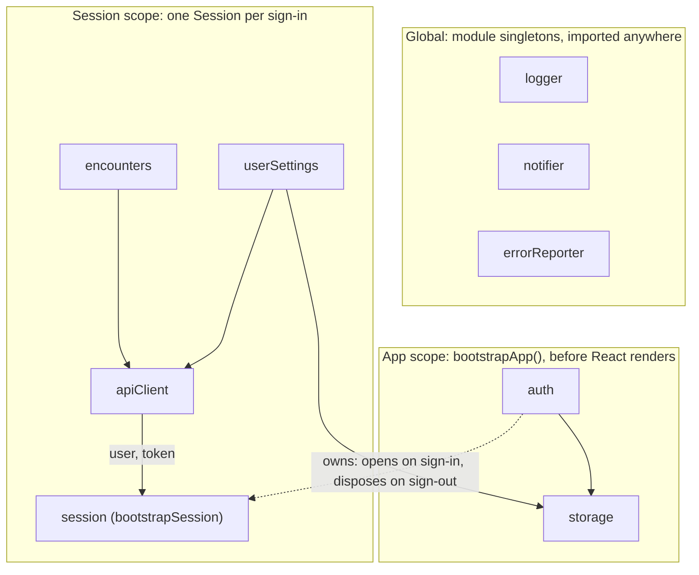

# React app with services outside the React tree

A small Nabla-style medical scribe (encounters list, note, settings), built to show one idea: **business logic lives in plain TypeScript services, and React only displays it.**

1. **Framework-agnostic core services.** Each service is a class behind an interface. Its public API is state + commands + lifecycle (`init` / `dispose`). Nothing under `src/services/` imports React, and `npm run build` checks that (`npm run check:layers`).
2. **Explicit bootstrapping.** Scoped services are created, initialized and torn down by plain functions (`bootstrapApp`, `bootstrapSession`), written top to bottom. Provider nesting plays no part in it.
3. **Hooks as thin adapters.** React gets a handle to a service through Context (or a plain import, for globals), subscribes with `useSyncExternalStore`, and passes the commands through. Hooks hold no logic.

## Where things live

The folder says which scope a service belongs to, so it also says how long the service lives:

```
src/services/
  global/    logger, notifier, errorReporter   module singletons: import them directly
  app/       storage, auth, bootstrapApp       created once, before React renders, then injected
  session/   session, apiClient, userSettings, encounters, bootstrapSession
                                               from sign-in to sign-out
  shared/    Store, Disposable, delay, demoFlags (helpers, not services)
src/context/  AppServicesContext, SessionServicesContext   hand services to React
src/hooks/    useAuth, useEncounters, useUserSettings, …    subscribe to them
```

**The dependency rule:** using a service points outward, and owning a child scope points one step inward.

- A file uses its own scope and outer ones: `session` → `app` → `global` → `shared`.
- Only an **owner** reaches one scope inward, to create the child it owns: `app/auth.ts` creates the `Session`. Nothing else does.

`npm run check:layers` ([`scripts/check-layers.mjs`](scripts/check-layers.mjs)) enforces both rules, and also that nothing under `src/services/` imports React. The owners are listed in that file.

### Global or injected?

Not everything needs dependency injection. `logger`, `notifier` and `reportError` are **module singletons**: services, routes and components import them directly. That fits a service that:

- has no dependencies on scoped services and no async setup,
- lives as long as the page, so it never needs disposing,
- is ambient: almost everything uses it, and passing it through every constructor only adds noise.

Everything else is injected: services that need `init()` (`storage`), or hold per-user data (anything under `session/`).

**Globals are configured by the entry point**, the way `Sentry.init()` or OpenTelemetry's setup is. The import is the same everywhere, but its behavior depends on app-specific information that only the app has. So each global exposes an `initXxx(options)` function that creates its instance, and [`main.tsx`](src/main.tsx) calls them first, before anything else runs:

```ts
initLogger({ scopeColors: { global: '#0891b2', app: '#2563eb', session: '#7c3aed' } })
initErrorReporter({ tags: { app: 'scribe', environment: import.meta.env.MODE } })
initNotifier({ autoDismissMs: 4000 })
```

Another app sharing the same globals passes its own values. `logger` and `notifier` are `export let` bindings that their init assigns, and ES modules let importers see the new value. **The rule: never use a global while modules load.** A module-level `const logger = rootLogger.scope('app')` would run before `main.tsx` calls `initLogger()`, so services create their scoped logger in a class field instead (`private readonly logger = rootLogger.scope('app')`). Breaking the rule fails loudly at startup (`Cannot read properties of undefined`), and so does a missing init. TypeScript can't catch it, though: the binding is typed `Logger`, even though it's `undefined` until init.

The trade-offs, which a real app should weigh:

- **Tests.** A global can't be replaced per instance, so a test has to mock the module instead of passing a fake.
- **Configuration.** The entry point passes static, app-wide details (see above). Details that change at runtime, like the current user, would need a setter called from the session. Here `session.ts` passes the user by hand.
- **UI copy in services.** Services call `notifier.notify({ message: 'Preferences saved' })` themselves. That's a deliberate shortcut: it shows that non-React code can reach the UI. In a larger app, services would return or throw, and callers would pick the wording (and the language).

## Running it

```sh
npm install
npm run dev      # http://localhost:3000
```

Other scripts:

| Script | What it does |
|---|---|
| `npm run typecheck` | `tsc -b`: type-checks the app (`tsconfig.app.json`, browser) and the Vite config (`tsconfig.node.json`, Node), incrementally |
| `npm run check:layers` | enforces the dependency rule between scopes, and that nothing under `src/services/` imports React or TanStack |
| `npm run build` | `check:layers` → `tsc -b` → `vite build` into `dist/` |
| `npm run preview` | serves the production build |

Open the browser DevTools **console**. Every service logs its lifecycle with a colored scope prefix:

```
[app] storage + created
[app] storage … init
[app] storage ✓ init (633ms)
[session] apiClient → GET /encounters
[session] apiClient ✗ disposed
```

Each service init, each bootstrap phase and each fake request is also recorded as a performance measure (User Timing, see [`shared/perf.ts`](src/services/shared/perf.ts)). Record a trace in the DevTools **Performance** panel. In Chrome, the measures show up in a **Services** track group, with one track each for `app`, `session` and `apiClient`. Nested measures, like `bootstrapSession init` around `userSettings init`, show what each phase waits for. Failures are shown in red.

## Scopes



| Scope | Created | Disposed |
|---|---|---|
| Global | when the module is first imported | never |
| App | once, by `bootstrapApp()` in `main.tsx` | never during normal use (`app.dispose()` exists) |
| Session | by `auth` on sign-in (or on startup if the user was restored) | by `auth` on sign-out, services in reverse creation order |

**The parent service holds the child scope in its state**: `auth.getState()` is `{ status: 'signedIn', user, session }`, and signing out disposes that session. There's no separate manager listening to `auth`.

## Code tour: suggested reading order

1. [`services/global/`](src/services/global/): the singletons. `export const logger = …`, `export const notifier = …`, `export function reportError(…)`. Nothing to wire, but each one has an `initXxx(options)` that creates the instance, and that [`main.tsx`](src/main.tsx) calls first, with this app's details.
2. [`services/app/auth.ts`](src/services/app/auth.ts): a typical injected service. Interface, `AuthDependencies`, class, `createAuthService` factory, `init` / `dispose`, reactive state through the [`Store`](src/services/shared/store.ts) helper. It also owns the session: `signIn()` creates one (closing any previous one), and `logout()` disposes it.
3. [`services/app/bootstrapApp.ts`](src/services/app/bootstrapApp.ts): the composition root, in two steps. First it **wires** every service by hand (constructors only store dependencies) and writes `dispose()` in reverse creation order. Then it **initializes** them in dependency order. If an `init()` fails, it disposes everything and rethrows.
4. [`main.tsx`](src/main.tsx): `bootstrapApp()` runs **before** React renders the app. React renders a spinner, an error screen, or the router. No `useEffect`.
5. [`services/session/session.ts`](src/services/session/session.ts) + [`bootstrapSession.ts`](src/services/session/bootstrapSession.ts): one `Session` per sign-in. It runs `bootstrapSession` and exposes the attempt as a promise: `ready()` returns the same one until `retry()` starts a new attempt after a failure. Nothing subscribes to it: the router awaits it. A session is single-use, so one `disposed` flag is enough to discard a bootstrap that finishes after sign-out. (A real app would also pass an `AbortSignal` into `bootstrapSession`, to cancel in-flight requests instead of waiting for them.) It only initializes what every screen needs (`userSettings`); routes load the rest (see [Placeholders](#placeholders)).
6. [`context/`](src/context/) + [`hooks/`](src/hooks/): the adapters. Contexts only carry services that already exist. Each hook is 3–10 lines: get the service, `useSyncExternalStore(service.subscribe, service.getState)`, return state + bound commands. `useNotifications` imports `notifier` instead of reading a context.
7. [`routes/_authenticated.tsx`](src/routes/_authenticated.tsx): `beforeLoad` awaits `session.ready()` and returns the services as route context, so every child route gets a non-null `context.session` (loaders included). The router shows its `pendingComponent` (placeholder) while it waits and its `errorComponent` if the session fails; Retry calls `session.retry()` then `router.invalidate()`. The layout provides `SessionServicesContext` from the route context. It doesn't start or stop anything. Since `beforeLoad` only runs on navigation, [`router.ts`](src/router.ts) invalidates the router whenever auth changes, so signing out redirects from wherever the user is.
8. [`services/session/encounters.ts`](src/services/session/encounters.ts) + [`encounters.tsx`](src/routes/_authenticated/encounters.tsx) + [`encounters/$encounterId.tsx`](src/routes/_authenticated/encounters/$encounterId.tsx): a session service driven by the router. The layout's `loader` awaits `encounters.loadList()`, with its own placeholder and error screen. The detail route's `loader` calls `encounters.openEncounter(id)` (on enter, on switching encounters, and on hover thanks to `defaultPreload: 'intent'`), and the page suspends on the cached note promise (see [Placeholders](#placeholders)).

## Placeholders

Screens that are about to load show grey placeholders shaped like the real screen ([`components/Placeholders.tsx`](src/components/Placeholders.tsx)). Two mechanisms are used, each where it fits:

- **A screen whose loader is running: the route's `pendingComponent`.** `/encounters` waits for its list in a `loader` and declares `pendingComponent: EncountersPending`, which draws its own layout (and its child's when an encounter is being opened). Each layout owns its placeholder. The router shows the pending component of the topmost route that isn't on screen yet. Navigating from settings to encounters, that's `/encounters`. On a cold load or right after sign-in, it's the session gate (`_authenticated`), for the whole time the session *and* the child loaders run; so the gate renders the `pendingComponent` of the first child route that declares one, or a spinner if none does (settings, which only needs the session).
- **Part of a screen, while its data loads: Suspense.** An encounter's note is fetched when you open it. The route's `loader` calls `encounters.openEncounter(id)` without awaiting it, which starts the fetch before the component renders (render-as-you-fetch). `encounters.getNote(id)` caches the promise for the rest of the session, so it returns the same one on every render. `useEncounterNote(id)` calls `use()` on it, and the detail page wraps it in `<Suspense fallback={<NotePlaceholder />}>` inside an `<ErrorBoundary>`. A failed fetch stays cached, because React re-renders once after a rejection and must get the same promise back. The boundary's Retry calls `encounters.invalidateNote(id)`, then re-renders, which fetches the note again. The service owns fetching and caching, and React only waits on the promise.

**Who loads what.** The session bootstrap only loads what every screen needs (`userSettings`). Data that only some screens need is loaded by their route (`encounters.loadList()`), so opening settings doesn't wait for encounters. The router decides *when* (loaders, pending and error UI); the service decides *how* and caches the result, so loaders return nothing and the router's own data cache stays unused. Trade-off: on a cold load of `/encounters`, the list is fetched after the session is ready instead of alongside it.

## Service conventions

- **Dependencies:** scoped services are passed in through `XxxDependencies`. Globals are imported.
- **Constructor:** stores dependencies and logs `created`. No timers, subscriptions or I/O.
- **`init()`** (optional, async): side effects and async setup.
- **`dispose()`:** undoes what `init()` did, and is safe to call even if `init()` never ran or failed.
- **Bootstrap functions are the async factories.** They wire everything, define `dispose()`, then initialize, and they resolve only when every service is ready. React and other services never see an uninitialized service. One deliberate exception: `auth.init()` *starts* the session without awaiting it, so app startup isn't blocked by session loading. The router waits on `session.ready()` instead.
- **No cycles between services.** Break them with a callback or by extracting a third service. Owners and children may share *types* (`auth` holds a `Session`, `Session` takes a `User`), but only the owner calls into the child.

## Demo scenarios

Tip: run `localStorage.clear()` in the console to start from a signed-out state.

### 1. Cold start
Load `/`. The UI shows **"Starting app…"** while `storage` (~400–800 ms) and then `auth` initialize. In the console: `[app] … + created`, `… init`, `✓ init (Nms)`, all in creation order. Then you land on `/login`.

### 2. Login
Click **Sign in** (any email works). The UI shows a **placeholder of the encounters screen** while `bootstrapSession` runs, then while the route loads the list. In the console: `[session] session + created`, `apiClient + created`, `userSettings` initializing, then `GET /encounters`, with every API request logged (`→` / `←`).

### 3. Reload while signed in
Reload the page. You get the app spinner, then the placeholder of the current screen, then the screen itself. On `/settings/profile` you get a spinner instead: settings has no loader, it only waits for the session, and never fetches the encounters. In the console: `[app] auth restored … from storage`, and the session scope is bootstrapped without a login.

### 4. Open an encounter
Open an encounter: the header shows right away and the note shows a placeholder while it's fetched (`GET /encounters/…/note`). Open it again later and it's instant, because the promise is cached.

### 5. Log out from settings
Go to **Settings** → **Profile** and click **Log out**:

```
[app] auth signed out
[session] encounters ✗ disposed            ← session services,
[session] userSettings ✗ disposed             in reverse creation order
[session] apiClient ✗ disposed
[session] session ✗ disposed
```

After this, any call to that `apiClient` throws `apiClient disposed`.

### 6. `?fail=storage` (app-level failure)
Open `/?fail=storage`. `storage.init()` throws after its normal delay. The console shows `✗ init failed`, every app service disposed in reverse creation order, and `[global] errorReporter ⚑ reported: …`. The UI shows the **error screen**. **Retry** runs `bootstrapApp()` again from scratch. `?fail=auth` works the same way.

### 7. `?fail=userSettings` (session-level failure)
Sign out, open `/login?fail=userSettings` and sign in. The session error screen appears **inside** the authenticated layout, and `errorReporter` logs the failure. The top bar still works, because app services are healthy: **Log out** works and toasts still show. **Retry** calls `session.retry()`, which bootstraps fresh session services.

### 8. `?fail=encounters` (a route's loader fails)
Open `/settings/profile?fail=encounters`, then click **Back to encounters**. The list fails to load: the encounters error screen shows inside the layout, and the top bar keeps working. **Retry** calls `router.invalidate()`, which re-runs the loader. The failed load wasn't cached, so it fetches again.

### 9. `?fail=note` (a failure inside a screen)
Open `/encounters?fail=note` and open an encounter. The note's fetch fails: the rest of the screen stays usable, and the note area shows the error with a **Retry** link. Retry invalidates the cached failure and fetches again, and the note appears.

> **Failure flags only fail the first attempt** (per page load), so Retry succeeds. Reload the page with the param still in the URL to make it fail again.

### Bonus: logout while the workspace is loading
Sign in and click **Log out** while the placeholder is shown. The console shows `session signed out while loading, discarding its services`, and the half-built services are disposed instead of becoming `ready`.

## Rule of thumb

Keep **visual, component-scoped** concerns in React: form drafts, hover/open state, a "Signing in…" button label. **Extract a service** when the behavior must outlive a component, be shared outside a UI subtree, be called from non-React code (another service, a router hook), or be tested without rendering anything.
